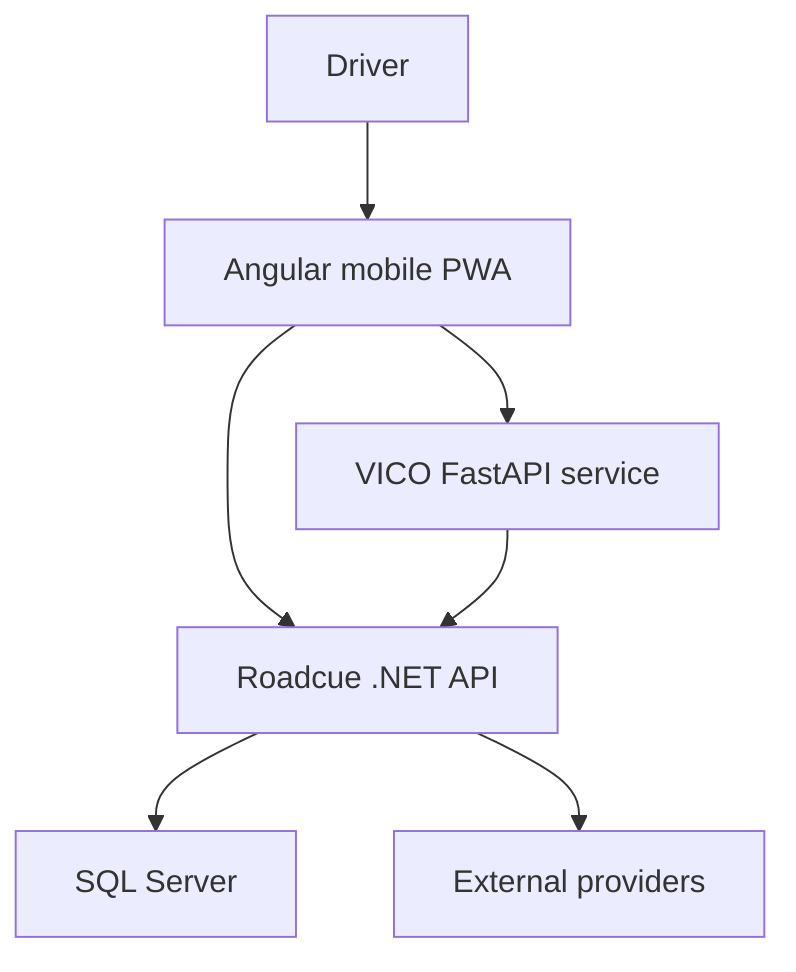

# Roadcue Solution Architecture

## Architectural intent

VICO is the driver's single conversational copilot. It orchestrates capabilities but does not replace Roadcue's deterministic backend or external specialist services.

The system uses a deliberately simple modular architecture for the POC and MVP:

Voice input/output is added around the Angular/VICO text interaction after the text-based agent flow is stable.

## Component ownership

| Component | Responsibility | Owns | Must not own |
|---|---|---|---|
| Angular mobile web/PWA | Screen UI, text/voice interaction, playback controls, user confirmation | Client interaction state | Business rules, SQL, geo calculations or model orchestration |
| Roadcue .NET API | Application services, authorization, business rules, calculations and provider abstraction | Roadcue domain truth and approved operations | General conversation or model reasoning |
| EF Core + SQL Server | Structured Roadcue persistence | Drivers, relations, permissions, positions, messages, observations and process records as implemented | Agent decisions or prompt logic |
| VICO FastAPI service | AI-facing API and composition root | AI service endpoints and model configuration | Direct Roadcue persistence |
| LangChain | Approved tool definitions, model binding and structured tool calls | Tool schemas at the AI boundary | C# business rules |
| LangGraph | Conversation state, routing, orchestration and later pause/resume | Agent workflow state | SQL access or precise deterministic calculations |
| External providers | Place, route, map, traffic, weather or speech data | Provider-specific source data | Roadcue authorization or cross-provider business policy |

## VICO internal architecture

- `app/graphs/vico_agent.py`: top-level VICO orchestration.
- `app/core/prompts/vico_system_prompt.py`: general VICO identity, conversation and safety behavior.
- `app/domains/<domain>/instructions.py`: domain-specific agent instructions.
- `app/domains/<domain>/tools.py` or equivalent: approved LangChain tools for the domain.
- `app/clients/`: HTTP clients for approved C# APIs and other owned service boundaries.
- `app/models/`: shared request/response and agent-state models, not business-domain duplicates.

Initial domains include conversation and Friends. Planned domains include context, places, messages, community, traffic, voice and proactivity. A domain is a modular area inside VICO, not automatically a separate deployable service.

## System boundaries

### C# is authoritative for

- authentication and authorization;
- SQL access and EF Core entities;
- position-sharing permissions;
- geoqueries, distance, direction, movement and time calculations;
- business state transitions and write operations;
- data quality/confidence calculations that require deterministic rules;
- interfaces to external place, traffic, weather and routing providers.

### Python/VICO is authoritative for

- natural-language understanding and response generation;
- deciding whether a question needs a tool;
- selecting and sequencing approved tools;
- combining tool results into one conversational response;
- conversation context and LangGraph orchestration;
- later pausing and resuming community workflows.

### The LLM must never

- connect directly to SQL Server;
- invent drivers, IDs, friends, locations or current conditions;
- perform authoritative distance, arrival, queue or parking calculations;
- bypass C# authorization or confirmation rules;
- control the vehicle.

## Provider independence

Google, HERE, TomTom, OpenStreetMap/openrouteservice or other providers must be placed behind Roadcue-owned C# interfaces. VICO calls Roadcue capabilities, not provider-specific APIs, unless an explicit accepted ADR changes the boundary.

## Deployment direction

The POC remains two application services plus SQL Server: Roadcue .NET API and VICO FastAPI, with Angular added as the product client. Do not introduce Kubernetes or split domains into microservices without a measured operational need and an accepted ADR.
