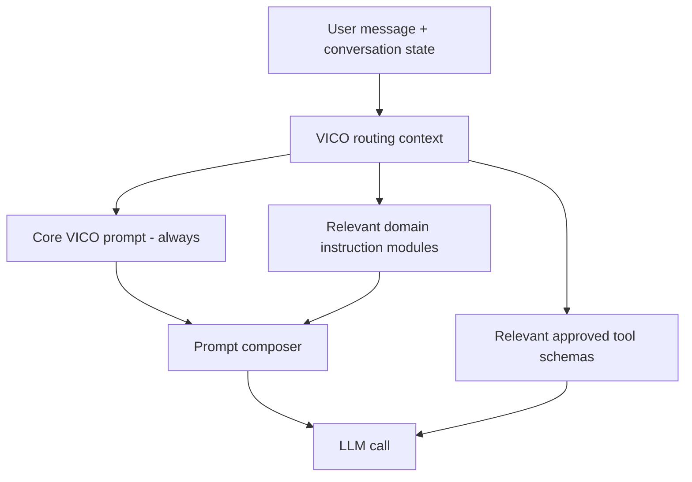

# Roadcue Prompt Composition and Routing

## Purpose

VICO uses one stable cross-domain system prompt plus domain-specific instruction modules. The architecture must remain simple during the POC without allowing the system prompt to grow indefinitely as new Roadcue capabilities are added.

This document defines the target architecture for selecting and composing prompts before each LLM call.

## Current POC state

The current implementation composes the system prompt from the general VICO prompt and the implemented domain instruction strings, for example:

```python
SYSTEM_PROMPT = "\n\n".join(
    [
        VICO_SYSTEM_PROMPT,
        FRIENDS_INSTRUCTIONS,
        DESTINATION_INSTRUCTIONS,
    ]
)
```

The Python string concatenation itself is insignificant and normally happens when the module is loaded. The scaling concern is that the resulting full prompt is sent with each model call.

With only a few domains this is acceptable. It is easy to understand, cheap to maintain and avoids premature routing complexity.

## Problem as VICO grows

If every future domain is permanently appended, every model call eventually receives instructions for unrelated capabilities:

```text
VICO_SYSTEM_PROMPT
+ FRIENDS_INSTRUCTIONS
+ DESTINATION_INSTRUCTIONS
+ PLACES_INSTRUCTIONS
+ TRAFFIC_INSTRUCTIONS
+ WEATHER_INSTRUCTIONS
+ MESSAGES_INSTRUCTIONS
+ COMMUNITY_INSTRUCTIONS
+ ...
```

That has three architectural costs:

- more input tokens and therefore potentially higher latency/cost;
- more unrelated instructions for the model to reconcile;
- tighter coupling in the top-level graph whenever a domain is added or changed.

The goal is not to minimize every token. The goal is to keep each model call focused on the capabilities relevant to the current conversational turn.

## Target model



The target is one composition boundary invoked by the VICO graph.

## Composition rules

1. `VICO_SYSTEM_PROMPT` is always included.
2. Domain instructions stay in `app/domains/<domain>/instructions.py`.
3. Only domains relevant to the current turn are included after selective composition is introduced.
4. More than one domain may be included for a genuine cross-domain request.
5. General conversation uses no domain prompt unless required.
6. Tool schemas should follow the same capability focus where practical; unrelated tools should not be exposed merely because they exist.
7. Prompt routing never replaces C# authorization, validation or business logic.
8. The model must not invent a missing domain or tool. Unsupported current-data requests follow the normal unavailable-source behavior.

## Examples

### General conversation

Driver:

> Fortæl en vittighed.

Composition:

```text
VICO_SYSTEM_PROMPT
```

No Friends or Destination instructions are required.

### Friends

Driver:

> Hvem er mine venner?

Composition:

```text
VICO_SYSTEM_PROMPT
+ FRIENDS_INSTRUCTIONS
```

Relevant Friends tools are available to the model.

### Destination

Driver:

> Jeg skal til Hamburg.

Composition:

```text
VICO_SYSTEM_PROMPT
+ DESTINATION_INSTRUCTIONS
```

The model can select the approved destination operation according to the domain rules.

### Cross-domain request

Driver:

> Er nogen af mine venner tæt på min destination?

Composition may include:

```text
VICO_SYSTEM_PROMPT
+ FRIENDS_INSTRUCTIONS
+ DESTINATION_INSTRUCTIONS
```

If additional deterministic place/distance data is needed, VICO uses approved tools; the LLM does not calculate authoritative distance itself.

## Routing strategy

Do not add another expensive LLM call solely to decide which prompt should be sent to the real LLM unless measurements later justify it.

Preferred progression:

### Stage 1 - current POC

Keep all implemented domain instructions concatenated. Measure correctness and keep the code simple.

### Stage 2 - explicit capability registry

Introduce a small prompt-composition module with registered domain metadata, for example conceptually:

```python
DOMAIN_PROMPTS = {
    "friends": FRIENDS_INSTRUCTIONS,
    "destination": DESTINATION_INSTRUCTIONS,
}
```

The graph supplies the active/relevant domain names and the composer returns the final system prompt.

### Stage 3 - richer routing only when required

If simple routing no longer handles ambiguous or strongly contextual turns, the graph may use richer classification based on conversation state, structured intent metadata or model/tool routing. This must remain observable and tested.

The architecture does not mandate keyword matching as the permanent intent detector. Hard-coded word lists become brittle with natural speech and references such as "der", "ham" or "den samme destination". Conversation state and existing tool-routing behavior must be considered.

## Suggested target code boundary

Conceptual target:

```text
app/
├── core/
│   └── prompts/
│       ├── vico_system_prompt.py
│       └── prompt_composer.py
├── domains/
│   ├── friends/
│   │   └── instructions.py
│   └── destination/
│       └── instructions.py
└── graphs/
    └── vico_agent.py
```

Responsibilities:

### `vico_system_prompt.py`

Contains only cross-domain VICO identity and global behavior.

### Domain `instructions.py`

Contains instructions only for that domain.

### `prompt_composer.py`

Target responsibility:

- knows the registry of available prompt modules or receives it through composition;
- receives the relevant domain identifiers for the current turn;
- returns the core prompt plus selected domain instructions;
- has no database, HTTP or provider responsibility;
- has no C# business rules.

### `vico_agent.py`

Owns orchestration:

- conversation state;
- relevant capability/tool routing;
- invocation of prompt composition;
- model/tool loop.

It should not permanently import and append every domain prompt inline as the long-term model.

## State and follow-up turns

Prompt selection must account for conversational context, not only the latest sentence.

Example:

```text
User: Jeg skal til Hamburg.
VICO: Hamburg er sat som destination.
User: Er der nogen af mine venner der?
```

The second message contains no explicit word such as "destination", but the prior state makes Destination/Friends context relevant.

Therefore selective prompt routing must preserve the existing stable `thread_id` and LangGraph conversation state. It must not break references such as "der", "ham", "den" or "samme sted".

## Performance and cost

Optimize based on measurement rather than prompt count alone.

Track at minimum when feasible:

- total input tokens per model call;
- selected domain modules;
- number of tool schemas exposed;
- response latency;
- tool-routing correctness;
- clarification rate caused by incorrect routing.

Do not add routing complexity if it costs more latency or model calls than it saves.

## Testing requirements

Prompt composition and routing tests must not call live OpenAI.

Tests should cover:

- general conversation -> core only;
- Friends request -> core + Friends;
- Destination request -> core + Destination;
- cross-domain request -> both relevant domains;
- unrelated domains are excluded;
- follow-up references use conversation state correctly;
- ambiguous routing fails safely or asks for clarification;
- domain registration order does not change behavioral authority;
- duplicate prompt modules are not included twice.

Integration tests may mock the model and assert the `SystemMessage` content or selected prompt-module metadata.

## Migration rule

Do not refactor the current implementation merely because this target architecture exists. Create an explicit implementation task when one of these conditions becomes true:

- several additional domain instruction modules are being appended globally;
- prompt size/latency becomes measurable overhead;
- unrelated instructions cause routing regressions;
- a new use case needs a reusable prompt-routing boundary.

Until then, the existing concatenate-all POC implementation is architecturally acceptable.
