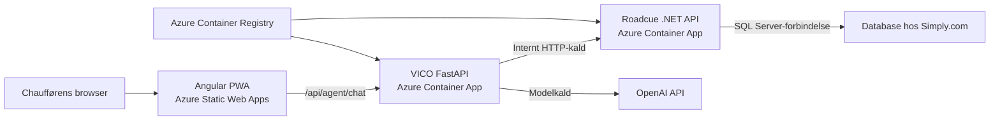

# UC-34 – Deploy Roadcue til Azure

**Fase:** MVP-drift efter fungerende lokal POC
**Status:** Planlagt – Azure-projektfiler og ressourcer er ikke oprettet endnu
**Primær aktør:** Udvikler/driftsansvarlig
**Mål:** Roadcue kan bygges og deployes reproducerbart til Azure uden at bryde grænsen mellem Angular, VICO, .NET og databasen hos Simply.com.

## Nuværende fundament

- Roadcue består af en Angular 20 PWA i `src/Roadcue.Web/`, en .NET 10 API i `src/Roadcue.Api/` og en FastAPI/VICO-service i `vico/`.
- Angular kalder det relative endpoint `/api/agent/chat`; den lokale `proxy.conf.json` fjerner `/api` og videresender kaldet til VICO.
- VICO eksponerer `POST /agent/chat` og `/health` og kalder Roadcue-data gennem `RoadcueApiClient`.
- VICO læser `ROADCUE_API_BASE_URL`, `OPENAI_API_KEY` og `OPENAI_MODEL` fra miljøvariabler.
- .NET ejer EF Core/SQL Server-adgangen og læser forbindelsen fra `ConnectionStrings:Roadcue`.
- Databasen forbliver hos Simply.com. Der findes ingen Dockerfiles, Azure-workflows eller Static Web Apps-konfiguration i repositoryet endnu.

## Målarkitektur

- Angular hostes i Azure Static Web Apps.
- VICO og .NET kører som to separate Azure Container Apps i samme Container Apps Environment.
- Azure Container Registry opbevarer de to container-images.
- Static Web Apps linker VICO som backend, så Angular kan beholde det eksisterende same-origin-kald til `/api/agent/chat` uden en hardkodet backend-host.
- VICO tilbyder `/api/agent/chat` som en tynd Azure-routingalias til den samme handler som det eksisterende `POST /agent/chat`; agentlogik, request/response og `thread_id`-adfærd må ikke duplikeres eller ændres.
- VICO kalder .NET internt via Container Apps service discovery, eksempelvis `http://roadcue-api`.
- .NET er den eneste applikationskomponent med en databaseforbindelse.

## Sikkerheds- og datagrænser

- `ConnectionStrings__Roadcue` må kun konfigureres som secret på .NET Container App.
- Angular, VICO, GitHub-kode og container-images må ikke indeholde Simply.com-forbindelsesstrengen.
- VICO må kun hente eller ændre Roadcue-data gennem godkendte HTTP-endpoints i .NET.
- `OPENAI_API_KEY` må kun konfigureres som secret på VICO Container App.
- Secrets må ikke commits, skrives i Dockerfiles, gemmes som almindelige GitHub-variabler eller udskrives i workflow-logs.
- Azure-login fra GitHub Actions skal bruge OpenID Connect/federeret identitet frem for en langlivet Azure client secret.
- Static Web Apps deployment token og eventuelle nødvendige registry-hemmeligheder skal gemmes som GitHub Actions secrets.
- Databaseporten hos Simply.com må kun åbnes for den nødvendige Azure-trafik. En eventuel IP-allowlist dokumenteres, før produktion tages i brug.

## Hovedflow

1. En ændring pushes eller merges efter repositoryets normale reviewproces.
2. CI bygger .NET, VICO og Angular og kører relevante automatiske tests.
3. Tests bruger mocks/fakes og må ikke kalde en live OpenAI-model eller andre betalbare AI-tjenester.
4. Ved deployment til `master` bygges .NET- og VICO-images fra hver sin Dockerfile.
5. Images tagges mindst med commit-SHA og pushes til Azure Container Registry.
6. De eksisterende Container Apps opdateres til de nye image-tags.
7. .NET starter med `ConnectionStrings__Roadcue` fra sin Azure-secret og forbinder til databasen hos Simply.com.
8. VICO starter med `ROADCUE_API_BASE_URL`, der peger på den interne .NET-app, samt OpenAI-konfiguration fra miljøvariabler/secrets.
9. Angular bygges og deployes til Azure Static Web Apps.
10. Static Web Apps videresender `/api/*` til den linkede VICO Container App, mens Angular-ruter bruger `index.html` som navigation fallback.
11. En smoke test verificerer VICO `/health` og et kontrolleret kald gennem den deployede grænse uden at udskrive secrets.

## Projektfiler

Implementeringen skal som minimum klargøre:

- en multi-stage Dockerfile til `src/Roadcue.Api/`, bygget med repository-roden som build context på grund af project references;
- en Dockerfile til `vico/`, som starter Uvicorn på `0.0.0.0:8000`;
- en testdækket FastAPI-routingalias fra `/api/agent/chat` til den eksisterende chat-handler, fordi Static Web Apps videresender `/api`-præfikset uændret;
- relevante `.dockerignore`-regler, så build-output, lokale miljøfiler, secrets og unødvendige filer ikke kopieres til images;
- `staticwebapp.config.json` til Angular-PWA navigation fallback uden at omskrive `/api/*`;
- GitHub Actions til CI, image build/push, Container Apps deployment og Static Web Apps deployment;
- en kort Azure-deploymentvejledning med nødvendige resource-, variable- og secret-navne samt manuelle opsætningstrin.

## Miljøkonfiguration

### Roadcue .NET API

- `ASPNETCORE_HTTP_PORTS=8080` eller tilsvarende dokumenteret containerport.
- `ConnectionStrings__Roadcue` leveres fra en Azure Container Apps secret.
- .NET Container App har intern ingress i samme Container Apps Environment som VICO, medmindre et senere autorisationskrav nødvendiggør ekstern adgang.

### VICO FastAPI

- `ROADCUE_API_BASE_URL=http://roadcue-api` eller det verificerede interne appnavn.
- `OPENAI_API_KEY` leveres fra en Azure Container Apps secret.
- `OPENAI_MODEL` leveres som almindelig miljøkonfiguration.
- VICO eksponerer port `8000` og er den Container App, der linkes som Static Web Apps-backend.

### Angular PWA

- Angular beholder `AGENT_CHAT_ENDPOINT = '/api/agent/chat'`.
- Produktionsbuildet må ikke indeholde en Azure-host, en databaseforbindelse eller en OpenAI-nøgle.
- `staticwebapp.config.json` kopieres med til build-outputtet.

## Deploymentregler

- Pull requests må køre build og tests, men må ikke deploye til det delte Azure-miljø.
- Deployment-workflows må kun køre på `master` eller ved en udtrykkelig manuel aktivering.
- Container Apps og Static Web App skal eksistere, før deploy-workflows forventes at lykkes; denne use case opretter ikke betalbare Azure-ressourcer automatisk.
- Azure resource names, resource group, registry-navn og appnavne gemmes som dokumenterede GitHub variables, ikke hardkodes flere steder.
- Images skal have et uforanderligt commit-SHA-tag, så en tidligere revision kan identificeres og genudrulles.
- Database-migrationer må ikke køres automatisk som en skjult sideeffekt af image build. Databaseskema og produktions-seeding håndteres som et særskilt, bevidst driftstrin.

## Alternative flows og fejl

- Hvis CI fejler, må deployment ikke starte.
- Hvis image build eller push fejler, bevares den aktive Container Apps-revision.
- Hvis .NET ikke kan forbinde til Simply.com, skal fejlen kunne ses i Container Apps-loggene uden at forbindelsesstrengen udskrives.
- Hvis VICO ikke kan nå .NET via det interne appnavn, skal deploymentvejledningen beskrive kontrol af miljø, ingress, appnavn og `ROADCUE_API_BASE_URL`.
- Hvis VICO mangler `OPENAI_API_KEY`, skal tjenesten fejle tydeligt uden at falde tilbage til en hardkodet nøgle.
- Hvis Static Web Apps ikke er linket til VICO, vil `/api/*` ikke fungere; dette verificeres som et eksplicit manuelt Azure-trin.
- Static Web Apps-backendintegration kræver Standard-planen, og API-backenden er ikke tilgængelig i pull-request preview environments. Dette skal fremgå af deploymentvejledningen.
- Hvis Simply.com kræver IP-allowlisting, må produktion ikke åbne databasen bredt som en hurtig løsning; de nødvendige Azure outbound-adresser og Simply.com-regler skal afklares.

## Acceptkriterier

- [ ] .NET API og VICO kan bygges som to separate container-images fra repositoryet.
- [ ] Containerne starter på dokumenterede porte og har ingen secrets indbygget i image-lagene.
- [ ] Angular kan bygges til Azure Static Web Apps med SPA-fallback og uden at omskrive `/api/*` til `index.html`.
- [ ] Angular beholder same-origin-kaldet `/api/agent/chat`, som kan videresendes til den linkede VICO Container App.
- [ ] Både `POST /agent/chat` og `POST /api/agent/chat` bruger den samme VICO-handler og den samme request-, response- og `thread_id`-adfærd.
- [ ] VICO og .NET kan deployes som separate Container Apps i samme environment.
- [ ] VICO kalder .NET gennem `ROADCUE_API_BASE_URL` og har ingen direkte databaseadgang.
- [ ] Kun .NET Container App modtager `ConnectionStrings__Roadcue`.
- [ ] Kun VICO Container App modtager `OPENAI_API_KEY`.
- [ ] CI bygger og tester alle tre applikationsdele uden live OpenAI-kald.
- [ ] Pull requests deployer ikke til det delte Azure-miljø.
- [ ] Deployment fra `master` bruger commit-SHA-taggede images og opdaterer de eksisterende Azure-ressourcer.
- [ ] Azure-login i deployment-workflows er baseret på OIDC/federeret identitet.
- [ ] Nødvendige GitHub variables, GitHub secrets, Azure secrets og manuelle portal-/CLI-trin er dokumenteret.
- [ ] Simply.com-databasen forbliver uden for Azure og kan kun nås fra Roadcue gennem .NET-servicen.
- [ ] Ingen workflow, test eller smoke test udskriver databaseforbindelsen eller OpenAI-nøglen.

## Uden for scope

- Automatisk oprettelse af Azure-abonnement, Resource Group, Container Apps Environment, Container Registry eller Static Web App.
- Kubernetes, AKS, Minikube, Helm eller samling af .NET og Python i samme pod/container.
- Flytning af databasen fra Simply.com til Azure.
- Direkte databaseadgang fra Python/VICO eller Angular.
- Ændringer i Roadcues domænelogik, agentadfærd, prompts eller eksisterende use cases.
- Produktionsautorisering, Entra-login, custom domains og fuld observability/alerting.
- Automatisk kørsel af EF Core-migrationer eller ændring af datamodel.

## Resultat

- Repositoryet indeholder en verificerbar og sikker deploymentvej til Azure Static Web Apps og Azure Container Apps, mens den eksisterende regel om, at Python kun kan nå databasen gennem .NET, er bevaret.
