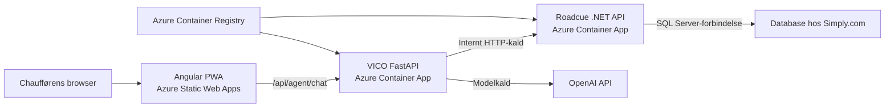

# UC-34 – Deploy Roadcue til Azure

**Fase:** MVP-drift efter fungerende lokal POC
**Status:** Done
**Primær aktør:** Udvikler/driftsansvarlig
**Mål:** Roadcue kan bygges og deployes reproducerbart til Azure uden at bryde grænsen mellem Angular, VICO, .NET og databasen hos Simply.com.

## Nuværende fundament

- Roadcue består af en Angular 20 PWA i `src/Roadcue.Web/`, en .NET 10 API i `src/Roadcue.Api/` og en FastAPI/VICO-service i `vico/`.
- Angular kalder det relative endpoint `/api/agent/chat`; den lokale `proxy.conf.json` fjerner `/api` og videresender kaldet til VICO.
- VICO eksponerer `POST /agent/chat` og `/health` og kalder Roadcue-data gennem `RoadcueApiClient`.
- VICO læser `ROADCUE_API_BASE_URL`, `OPENAI_API_KEY` og `OPENAI_MODEL` fra miljøvariabler.
- .NET ejer EF Core/SQL Server-adgangen og læser forbindelsen fra `ConnectionStrings:Roadcue`.
- Databasen forbliver hos Simply.com.

## Målarkitektur

- Angular hostes i Azure Static Web Apps.
- VICO og .NET kører som to separate Azure Container Apps i samme Container Apps Environment.
- Azure Container Registry opbevarer de to container-images.
- Static Web Apps linker VICO som backend, så Angular kan beholde det eksisterende same-origin-kald til `/api/agent/chat` uden en hardkodet backend-host.
- VICO tilbyder `/api/agent/chat` som en tynd Azure-routingalias til den samme handler som det eksisterende `POST /agent/chat`.
- VICO kalder .NET internt via Container Apps service discovery.
- .NET er den eneste applikationskomponent med en databaseforbindelse.

## Sikkerheds- og datagrænser

- `ConnectionStrings__Roadcue` må kun konfigureres som secret på .NET Container App.
- Angular, VICO, GitHub-kode og container-images må ikke indeholde Simply.com-forbindelsesstrengen.
- VICO må kun hente eller ændre Roadcue-data gennem godkendte HTTP-endpoints i .NET.
- `OPENAI_API_KEY` må kun konfigureres som secret på VICO Container App.
- Secrets må ikke commits, skrives i Dockerfiles, gemmes som almindelige GitHub-variabler eller udskrives i workflow-logs.
- Azure-login fra GitHub Actions skal bruge OpenID Connect/federeret identitet frem for en langlivet Azure client secret.

## Hovedflow

1. En ændring pushes eller merges efter repositoryets normale reviewproces.
2. CI bygger .NET, VICO og Angular og kører relevante automatiske tests.
3. Tests bruger mocks/fakes og må ikke kalde en live OpenAI-model eller andre betalbare AI-tjenester.
4. Ved deployment til `master` bygges .NET- og VICO-images fra hver sin Dockerfile.
5. Images tagges mindst med commit-SHA og pushes til Azure Container Registry.
6. De eksisterende Container Apps opdateres til de nye image-tags.
7. .NET starter med `ConnectionStrings__Roadcue` fra sin Azure-secret og forbinder til databasen hos Simply.com.
8. VICO starter med `ROADCUE_API_BASE_URL`, der peger på den interne .NET-app, samt OpenAI-konfiguration fra miljøvariabler/secrets.
9. Angular bygges og deployes til Azure Static Web Apps.
10. Static Web Apps videresender `/api/*` til den linkede VICO Container App.

## Acceptkriterier

- [ ] .NET API og VICO kan bygges som to separate container-images fra repositoryet.
- [ ] Containerne starter på dokumenterede porte og har ingen secrets indbygget i image-lagene.
- [ ] Angular kan bygges til Azure Static Web Apps med SPA-fallback og uden at omskrive `/api/*` til `index.html`.
- [ ] Angular beholder same-origin-kaldet `/api/agent/chat`.
- [ ] Både `POST /agent/chat` og `POST /api/agent/chat` bruger den samme VICO-handler og den samme request-, response- og `thread_id`-adfærd.
- [ ] VICO og .NET kan deployes som separate Container Apps i samme environment.
- [ ] VICO kalder .NET gennem `ROADCUE_API_BASE_URL` og har ingen direkte databaseadgang.
- [ ] Kun .NET Container App modtager `ConnectionStrings__Roadcue`.
- [ ] Kun VICO Container App modtager `OPENAI_API_KEY`.
- [ ] CI bygger og tester alle tre applikationsdele uden live OpenAI-kald.
- [ ] Pull requests deployer ikke til det delte Azure-miljø.
- [ ] Deployment fra `master` bruger commit-SHA-taggede images og opdaterer de eksisterende Azure-ressourcer.
- [ ] Azure-login i deployment-workflows er baseret på OIDC/federeret identitet.
- [ ] Simply.com-databasen forbliver uden for Azure og kan kun nås fra Roadcue gennem .NET-servicen.

## Resultat

- Repositoryet indeholder en verificerbar og sikker deploymentvej til Azure Static Web Apps og Azure Container Apps, mens den eksisterende regel om, at Python kun kan nå databasen gennem .NET, er bevaret.
